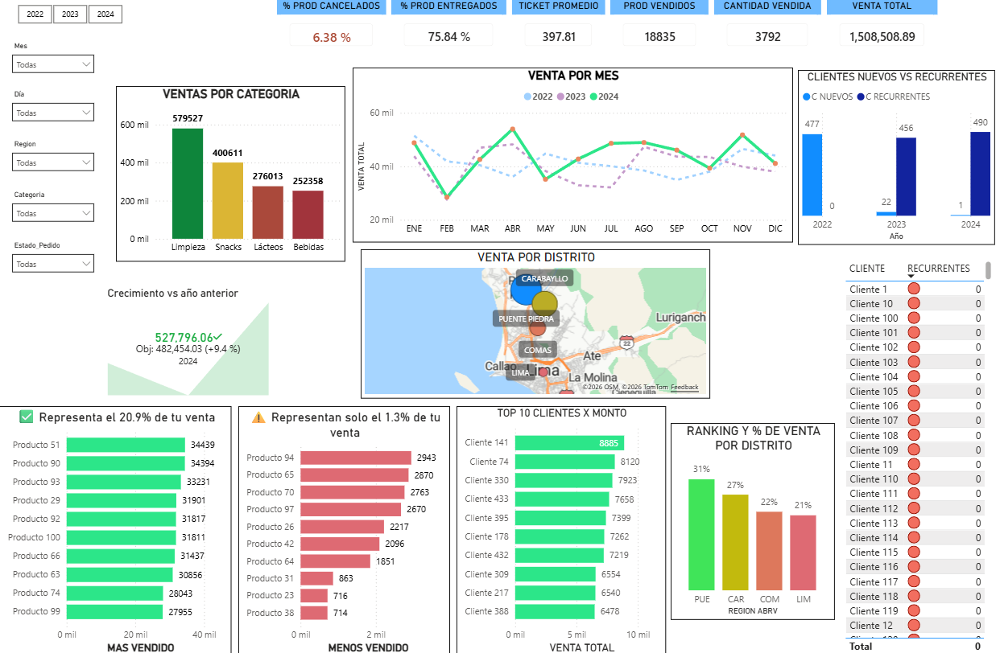
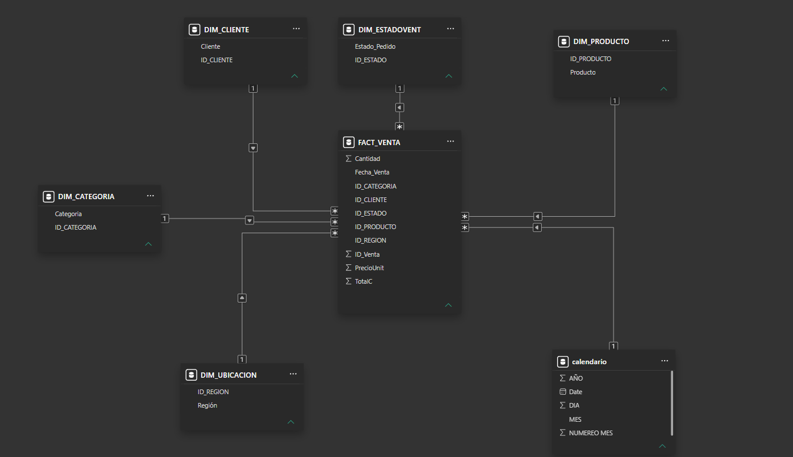

# Dashboard de Análisis de Ventas y Rendimiento Comercial (Lima)

## Descripción del Proyecto
Este dashboard interactivo fue desarrollado en Power BI para analizar de manera integral el rendimiento comercial, transaccional e histórico de las ventas durante el periodo 2022 - 2024. Permite evaluar ingresos globales, el cumplimiento de objetivos comerciales del año en curso, el comportamiento de retención de clientes, la eficiencia de la estrategia logística y la distribución geoespacial de la demanda en Lima Metropolitana.

## Vista General del Dashboard

## Key Performance Indicators (KPIs) Globales
* **Venta Total Acumulada:** 1,508,508.89
* **Crecimiento vs. Año Anterior (2024):** 527,796.06 logrando superar el objetivo planteado de 482,454.03 en un **+9.4%** (marcado en verde).
* **Ticket Promedio:** 397.81 por transacción.
* **Productos Vendidos:** 18,835 unidades.
* **Efectividad Logística:** Alta tasa de éxito con el **75.84%** de productos entregados frente a solo un **6.38%** de cancelaciones.

## Insights y Secciones Clave
* **Análisis de Categorías:** La categoría de **Limpieza** lidera ampliamente las ventas con 579,527, seguida por *Snacks* (400,611), *Lácteos* (276,013) y *Bebidas* (252,358).
* **Evolución Temporal (Venta por Mes):** Gráfico de líneas que compara las tendencias mensuales de 2022, 2023 y 2024, permitiendo identificar picos estacionales de demanda (destacando un fuerte incremento generalizado en el mes de abril).
* **Análisis Geográfico (Lima):** Mapeo y distribución de ventas concentrado en distritos clave como Puente Piedra (PUE), Carabayllo (CAR), Comas (COM) y Cercado de Lima (LIM). El ranking por abreviaturas posiciona a Puente Piedra a la cabeza con el 31% de la participación regional.
* **Segmentación e Historial de Clientes:** Muestra la evolución de captación donde el año 2022 inició puramente con Clientes Nuevos (477) y mutó hacia la retención en los años posteriores, evaluando el top de clientes por monto (liderado por Cliente 141 con una compra de 8,885).
* **Optimización de Inventario (Regla de Pareto):**
  * **Más Vendidos:** El top de productos estrella representa el **20.9%** de la venta total (liderado por el Producto 51).
  * **Menos Vendidos:** Un grupo crítico de productos aporta únicamente el **1.3%** de la facturación global, facilitando decisiones estratégicas de depuración o promociones de salida.

##  Arquitectura Técnica y Modelado de Datos
El proyecto sigue rigurosamente las mejores prácticas de Business Intelligence mediante la implementación de un **Modelo en Estrella**, garantizando un rendimiento óptimo en las consultas y simplicidad en el mantenimiento de las medidas.

### Estructura del Modelo:
* **Tabla de Hechos (`FACT_Venta`):** Centraliza las métricas transaccionales como `Cantidad`, `PrecioUnit`, `TotalC` y las llaves foráneas (`ID`) que conectan con las dimensiones.
* **Tablas de Dimensiones (`DIM`):**
  * `DIM_CLIENTE`: Atributos descriptivos de los compradores.
  * `DIM_ESTADOVENT`: Estados del pedido (`Estado_Pedido`) para el análisis logístico.
  * `DIM_PRODUCTO`: Catálogo de ítems vendidos.
  * `DIM_CATEGORIA`: Agrupación de productos (Limpieza, Snacks, Lácteos, Bebidas).
  * `DIM_UBICACION`: Datos geoespaciales enfocados en las regiones/distritos.
  * `calendario`: Tabla de tiempo personalizada con campos estructurados (`AÑO`, `MES`, `NUMEREO MES`, `DIA`) necesaria para cálculos de Inteligencia de Tiempo (Time Intelligence).

## Tecnologías Utilizadas
* **Power BI Desktop:** Modelado relacional y maquetación de la interfaz visual (UI/UX).
* **Power Query:** Procesamiento de datos (ETL) para la normalización, limpieza y creación de llaves subrogadas de las fuentes originales.
* **Lenguaje DAX:** Modelado analítico avanzado para KPIs dinámicos utilizando funciones de agregación e inteligencia temporal.
